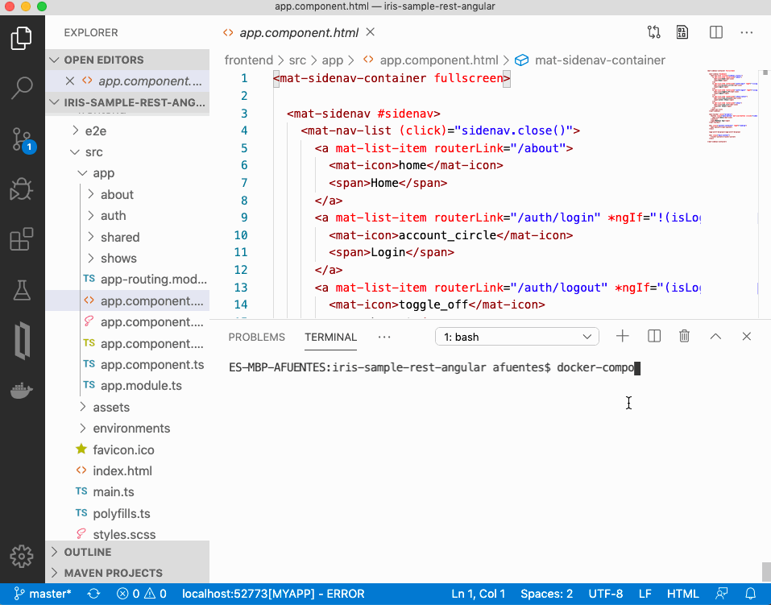

# Desarrollo aplicación Angular + InterSystems IRIS

Utilizaremos este repositorio para la sesión *Desarrollo de REST APIs y Web Apps sobre IRIS* del [Iberia Summit 2020](https://www.intersystems.com/es/noticias-eventos/eventos/iberia-summit-barcelona-2020-18-y-19-de-febrero/)

<a href="https://www.intersystems.com/es/noticias-eventos/eventos/iberia-summit-barcelona-2020-18-y-19-de-febrero/"></a>

Idiomas: [🇺🇸](README.md)[🇪🇸](README.es.md)

# ¿Qué aprenderás?
Desarrollaremos una aplicación web sobre el framework *Angular* utilizando como *backend* una instancia *InterSystems IRIS*. Veremos cómo podemos exponer los datos en formato JSON a través de APIs REST que podemos implementar o generar automáticamente.
 
La sesión está orientada hacia todos aquellos interesados en *cómo desarrollar aplicaciones web modernas* siguiendo la arquitectura de Single Page Application aprovechando al mismo tiempo las posibilidades de *InterSystems IRIS* como plataforma de datos.



# ¿Qué necesitas instalar?
Para poder seguir la sesión con tu propio portátil necesitas instalar: 
* [Git](https://git-scm.com/downloads) 
* [Docker](https://www.docker.com/products/docker-desktop)
* [Docker Compose](https://docs.docker.com/compose/install/)
* [Visual Studio Code](https://code.visualstudio.com/download) + [InterSystems ObjectScript VSCode Extension](https://marketplace.visualstudio.com/items?itemName=daimor.vscode-objectscript)
* [Postman](https://www.getpostman.com/downloads/)

Y además, tendrás que descargar las imágenes Docker que utilizaremos:
```console
$ git clone https://github.com/intersystems-ib/iris-sample-rest-angular
$ cd iris-sample-rest-angular
$ docker-compose pull
```

# Puesta en marcha
Para poner en marcha la academia, ejecuta lo siguiente:
```
$ docker-compose up
```

Tendrás disponible lo siguiente: 
* *Backend* - InterSystems IRIS: http://localhost:52773/csp/sys/UtilHome.csp
* *Frontend* - Aplicación Web Angular: http://localhost:4200

# ¿Qué vamos a desarrollar?
* Partiremos de un sistema que es capaz de procesar un *dataset* con información sobre NetFlix.
* La información procesada se almacenará en clases persistentes en IRIS.
* Expondremos la información almacenada en *JSON* a través de interfaces *REST* para poder consumirla desde una aplicación *Angular*.
* Desarrollaremos nuevas funcionalidades sobre la aplicación web.


# Backend
NOTA: utiliza el usuario y password por defecto *superuser* / *SYS*

## Examinar *dataset* NetFlix
* En IRIS tenemos creada una producción que se encarga de procesar un CSV con un *dataset* de Netflix.
* Echa un vistazo a la producción y a los mensajes procesados en [Interoperability](http://localhost:52773/csp/myapp/EnsPortal.ProductionConfig.zen?PRODUCTION=App.Prod).

## Explora los datos utilizando SQL / Objetos / JSON
* Abre las clases `App.Data.Show` y `App.Data.Cast` utilizando VS Code. Estas clases utilizan `%JSON.Adaptor` para permitir exportar e importar información en formato JSON. En el artículo [Mejoras en Procesamiento JSON](https://es.community.intersystems.com/post/mejoras-en-procesamiento-json) tienes más información `%JSON.Adaptor` y como funciona.
* Prueba a hacer un SELECT sobre la tabla `App_Data.Show` en el [SQL Explorer](http://localhost:52773/csp/sys/exp/%25CSP.UI.Portal.SQL.Home.zen?$NAMESPACE=MYAPP)
* Examina también a través de objetos la información cargada utilizando una sesión de [WebTerminal](http://localhost:52773/terminal/).
```objectscript
// abrir objeto Show
set show = ##class(App.Data.Show).%OpenId(449931)
// exportar a JSON
do show.%JSONExport()
```

## Interfaces REST
Tenemos la información del *dataset* de Netflix almacenada y somos capaces de exportar / importar información desde nuestras clases persistentes utilizando `%JSON.Adaptor`.

¿Cómo podemos consumir esa información en formato JSON desde una aplicación Angular? utilizaremos interfaces REST. Para nuestro caso tenemos dos opciones que podemos combinar.

### Implementar una API REST
Podemos implementar una API REST con las operaciones que necesitemos partiendo de una especificación *OpenAPI*. 
En el webinar [Desarrollar y gestionar APIs con InterSystems IRIS](https://comunidadintersystems.com/desarrollar-y-gestionar-apis-con-intersystems-iris) tienes un [ejemplo completo](https://github.com/es-comunidad-intersystems/webinar-gestion-apis) sobre cómo hacerlo.

### API REST automática
[RESTForms2](https://openexchange.intersystems.com/package/RESTForms2) es una aplicación que nos permite generar APIs REST de forma automática para nuestras clases persistentes, de forma que soporten operaciones CRUD (Create, Read, Update, Delete). Incluso soporta consultas SQL que hayamos definido.

RESTForms2 ya está instalado en el contenedor *backend* de IRIS que estamos utilizando. Así que podemos probarlo directamente sobre nuestras clases `App.Data.Show` y `App.Data.Cast`:
* Abre *Postman* e importa la colección `backend/postman/MyApp.postman_collection.json`.
* Prueba los diferentes ejemplos incluídos en la colección.


Utilizaremos esta API REST generada automáticamente como base para la comunicación entre el *frontend* y el *backend*.

# Frontend
El *frontend* es una aplicación *Angular 8* muy sencilla que consume las interfaces REST del *backend* de manera que permiter realizar operaciones sobre las estructuras de datos que hemos visto antes en IRIS.

| Módulo | Descripción |
| --- | --- |
| App | Módulo general de la aplicación |
| AppRouting | Módulo encargado de gestionar las rutas (URLs) utilizadas en la aplicación |
| About | Contiene el componente *about* que se usa como página inicial (*home*) de la aplicación |
| Shared | Módulo compartido que incluye referencias a [Angular Material](https://material.angular.io)  |
| Auth | Implementa autenticación básica contra el *backend* |
| Shows | Servicios y componentes que utilizan las estructuras de datos `Show` y `Cast` del *backend*  |

Nos centraremos en el módulo *Shows*, que incluye:

| Elemento | Descripción |
| --- | --- |
| `shows.model` | Estructuras de datos `Show` y `Cast` que utilizaremos en la aplicación |
| `shows.service` | Servicio que consume las interfaces REST *backend*. Los componentes utilizan este servicio   |
| `show-latest` | Componente que muestra los `Shows` más reciente en formato tarjeta o *card*  |
| `show-edit-dialog` | Componente que permite editar un `Show` utilizando un ventana de diálogo  |
| `cast-list` | Componente que muestra en una tabla el casting `Cast` de un `Show` |
| `cast-edit-dialog` | Componente que permite editar un `Cast` utilizando una ventana de diálogo |
| `show-list` | Componente que muestra todos los `Show` en una tabla. Incluye paginación y búsqueda |

Examina y prueba la aplicación. La tienes disponible en http://localhost:4200

NOTA: es recomendable que tengas activadas las *Developer Tools* de Chrome o Safari.

## ¿Hacemos algunos cambios?
Te propongo implementar algunos cambios como ejercicio.

### Botón para mostrar el casting de un Show en *show-list*
Añadir un botón que nos permita acceder al casting de cualquier show de los que aparecen en la tabla de `show-list`.
El componente `show-latest` ya tiene ese comportamiento. Se trata de replicarlo en la tabla de `show-list`. 

___
Añadiremos una nueva definición de columna en `show-list`. La llamaremos `actions` y la utilizaremos para colocar las acciones que queramos hacer sobre una fila de la tabla. Incluiremos un botón para navegar hacia el componente `cast-list` utilizando el identificador del `Show`.

> frontend/src/app/shows/show-list/show-list.component.html
```javascript
    <ng-container matColumnDef="actions">
      <mat-header-cell *matHeaderCellDef></mat-header-cell>
      <mat-cell *matCellDef="let show">
        <button mat-icon-button [routerLink]="['/shows/' + show.id + '/cast']" matTooltip="Casting">
          <mat-icon>people_alt</mat-icon>
        </button>
      </mat-cell>
    </ng-container>
```

___
La propiedad `displayedColumns` de `show-list` se utiliza para indicar al componente [mat-table](https://material.angular.io/components/table/overview) las columnas que debe mostrar. Tenemos que incluir aquí nuestra nueva columna `actions`.

> frontend/src/app/shows/show-list/show-list.component.ts
```javascript
displayedColumns = ['actions', 'title', 'description'];
```


### Incluir "year" como información que aparece en cada Show en la aplicación
El *backend* (IRIS) ya tiene incluido `year` como una propiedad de `App.Data.Show` pero no lo estamos mostrando en la aplicación. A continuación vamos a incluirlo en diferentes puntos de nuestra aplicación:

___
Comenzamos por añadir añadir la propiedad `year` al modelo de datos que utilizamos en Angular

> frontend/src/app/shows/shows.model.ts
```javacript
export interface Show {
    id: number;
    name: string;
    description: string;
    year: string;
}
```

___
Modificaremos también la query `App.Data.Show:queryFIND` que estamos utilizando en el IRIS (a través de la API automática de RESTForms2) para incluir la propiedad `year`

> backend/src/App/Data/Show.cls
```objectscript
ClassMethod queryFIND() As %String
{
  quit "showid id, title, year, description "
}
```

___
Ahora ya podemos mostrar `year` en el componente `show-latest`

> frontend/src/app/shows/show-latest/show-latest.component.html
```javascript
   <mat-card-header>
      <mat-card-title>{{show.title}} <small>{{ show.year }}</small></mat-card-title>
   </mat-card-header>
```

___
Vamos a permitir que se pueda modificar el campo `year` igualmente en `show-edit-dialog`

> frontend/src/app/shows/show-edit-dialog/show-edit-dialog.component.ts
```javascript
    const formControls = {
      title: ['', Validators.required],
      description: ['', Validators.required],
      year: ['', Validators.required]
    };
```

> frontend/src/app/shows/show-edit-dialog/show-edit-dialog.component.html
```javascript
   <mat-form-field>
     <textarea matInput placeholder="Year" formControlName="year">
     </textarea>
   </mat-form-field>
```

___
También mostraremos `year` como una columna en `show-list` y ocultaremos la columna `id` ya que es un identificador interno. Para ello igual que antes vamos a crear una nueva definición de columna llamada `year`.

> frontend/src/app/shows/show-list/show-list.component.html
```javascript
    <ng-container matColumnDef="year">
      <mat-header-cell *matHeaderCellDef>Year</mat-header-cell>
      <mat-cell *matCellDef="let show">{{ show.year }}</mat-cell>
    </ng-container>
```

___
Cambiaremos la definición de las columnas que se muestran en el componente:

> frontend/src/app/shows/show-list/show-list.component.ts
```javascript
displayedColumns = ['actions', 'title', 'year', 'description'];
```

¡Y esto es todo!

No olvides echarle un ojo a [angular-material-iris-starter](https://github.com/intersystems-community/angular-material-iris-starter) para aprender sobre funcionalidades un poco más complejas en Angular.