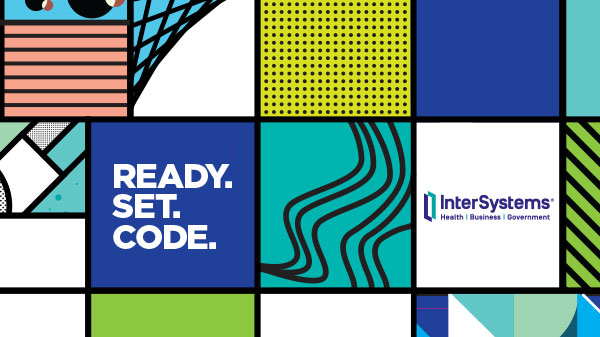
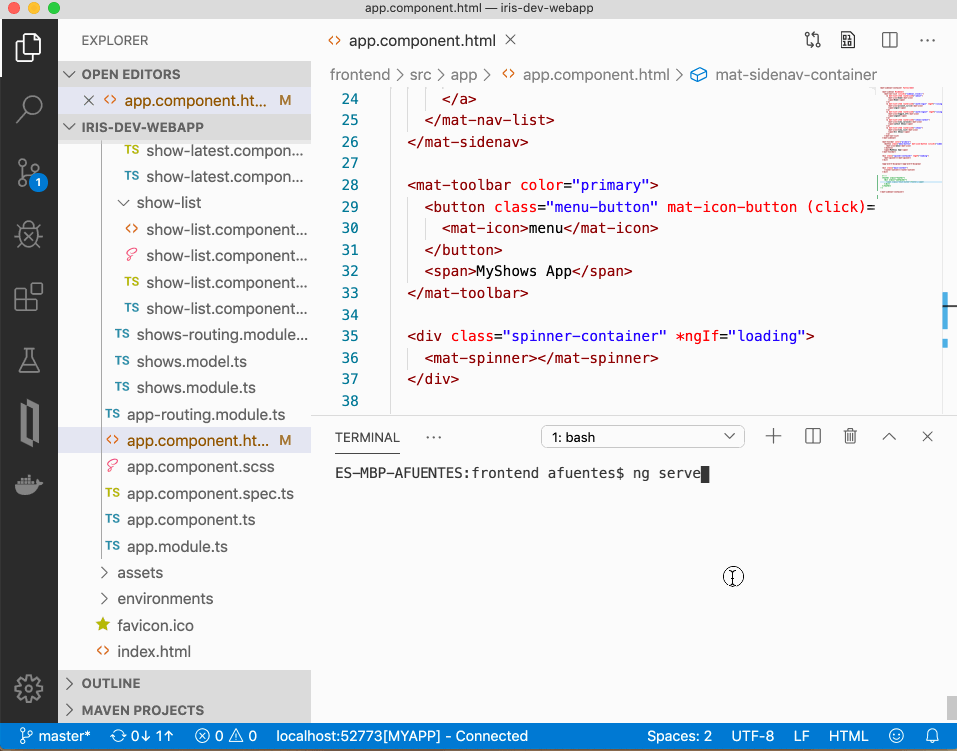

# Desarrollo aplicación Angular + InterSystems IRIS

Utilizaremos este repositorio para la sesión *Desarrollo de REST APIs y Web Apps sobre IRIS* del [Iberia Summit 2020](https://www.intersystems.com/es/noticias-eventos/eventos/iberia-summit-barcelona-2020-18-y-19-de-febrero/)

<a href="https://www.intersystems.com/es/noticias-eventos/eventos/iberia-summit-barcelona-2020-18-y-19-de-febrero/"></a>

# ¿Qué aprenderás?
Desarrollaremos una aplicación web sobre el framework *Angular* utilizando como *backend* una instancia *InterSystems IRIS*. Veremos cómo podemos exponer los datos en formato JSON a través de APIs REST que podemos implementar o generar automáticamente.
 
La sesión está orientada hacia todos aquellos interesados en *cómo desarrollar aplicaciones web modernas* siguiendo la arquitectura de Single Page Application aprovechando al mismo tiempo las posibilidades de *InterSystems IRIS* como plataforma de datos.



# ¿Qué necesitas instalar?
Para poder seguir la sesión con tu propio portáil necesitas instalar: 
* [Git](https://git-scm.com/downloads) 
* [Docker](https://www.docker.com/products/docker-desktop)
* [Docker Compose](https://docs.docker.com/compose/install/)
* [Visual Studio Code](https://code.visualstudio.com/download) + [InterSystems ObjectScript VSCode Extension](https://marketplace.visualstudio.com/items?itemName=daimor.vscode-objectscript)
* [Postman](https://www.getpostman.com/downloads/)

Y además, necesitarás descargar las imágenes de los contenedores que vamos a utilizar:
```console
$ git clone https://github.com/intersystems-ib/iris-dev-webapp
$ cd iris-dev-webapp
$ docker-compose pull
```
