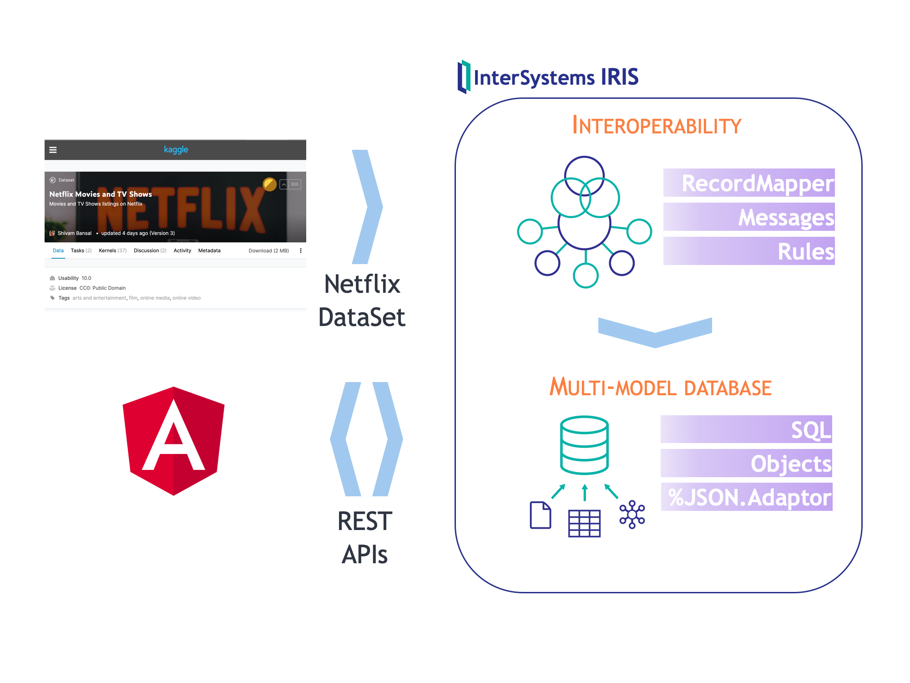

# Desarrollo aplicación web Angular + InterSystems IRIS

# ¿Qué necesitas?
* [Docker](https://www.docker.com/products/docker-desktop)
* [Docker Compose](https://docs.docker.com/compose/install/)
* [Visual Studio Code](https://code.visualstudio.com/download) + [InterSystems ObjectScript VSCode Extension](https://marketplace.visualstudio.com/items?itemName=daimor.vscode-objectscript)

Además, si quieres desarrollar la aplicación Angular directamente desde tu local:
* [Node.js v12 + npm](https://nodejs.org/es/download/)

# Instalación
## Descargar código
```console
$ git clone https://github.com/intersystems-ib
```

## Opción 1. Desarrollo Angular en local
Necesitarás tener instalado [Node.js v12](https://nodejs.org/es/download/) en tu local
```bash
# construir/ejecutar backend (IRIS)
$ docker-compose up backend

# ejecutar frontend (Angular) en local
$ cd frontend    # directorio de frontend
$ npm install    # instalar dependencias
$ ng serve       # ejecutar servidor web desarrollo
```

## Opción 2. Desarrollo Angular en contenedor
Utiliza esta opción si no tienes instalado Node.js v12 en tu local
```bash
# construir/ejecutar backend (IRIS) + frontend (Angular)
$ docker-compose up
```

Tras la instalación, tendrás: 
* *Backend* - InterSystems IRIS: http://localhost:52773/csp/sys/UtilHome.csp
* *Frontend* - Aplicación Web Angular: http://localhost:4200

# ¿Qué vamos a desarrollar?
* Partiremos de un sistema que es capaz de procesar un *dataset* con información sobre NetFlix
* La información procesada se almacenará en clases persistentes en IRIS
* Expondremos la información almacenada en *JSON* a través de interfaces *REST* para poder consumirla desde una aplicación *Angular*
* Desarrollaremos nuevas funcionalidades sobre la aplicación web.


# Backend
## Examinar *dataset* NetFlix
* En IRIS tenemos creada una producción (*Interoperabilidad*) que se encarga de procesar un CSV con un *dataset* de Netflix.
* Echa un vistazo a la producción y a los mensajes procesados
http://localhost:52773/csp/myapp/EnsPortal.ProductionConfig.zen?PRODUCTION=App.Prod

