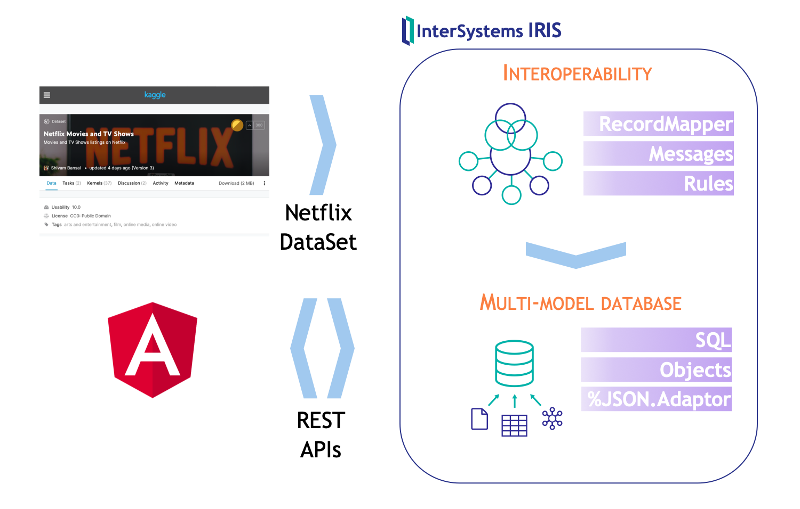
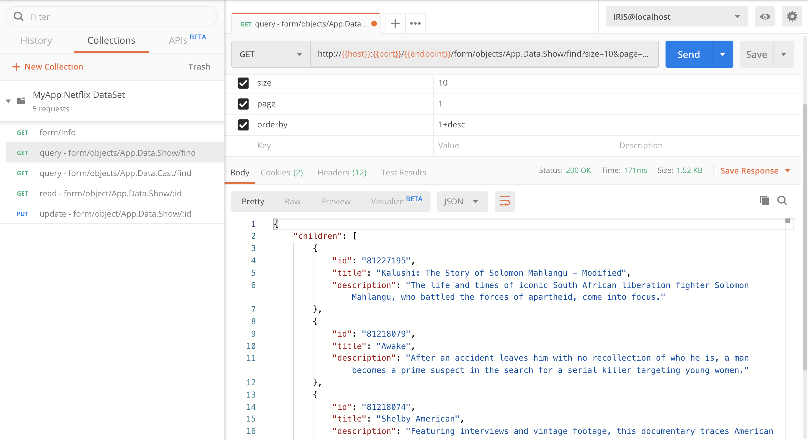

# Desarrollo aplicación web Angular + InterSystems IRIS


# ¿Qué necesitas?
* [Git](https://git-scm.com/downloads) 
* [Docker](https://www.docker.com/products/docker-desktop)
* [Docker Compose](https://docs.docker.com/compose/install/)
* [Visual Studio Code](https://code.visualstudio.com/download) + [InterSystems ObjectScript VSCode Extension](https://marketplace.visualstudio.com/items?itemName=daimor.vscode-objectscript)
* [Postman](https://www.getpostman.com/downloads/)

Además, si quieres desarrollar la aplicación Angular directamente desde tu local:
* [Node.js v12 + npm](https://nodejs.org/es/download/)

# Instalación
## Descargar código
```console
$ git clone https://github.com/intersystems-ib
```

## Opción 1. Desarrollo Angular en local
Necesitarás tener instalado [Node.js v12](https://nodejs.org/es/download/) en tu local
```bash
# construir/ejecutar backend (IRIS)
$ docker-compose build backend
$ docker-compose up backend

# ejecutar frontend (Angular) en local
$ cd frontend    # directorio de frontend
$ npm install    # instalar dependencias
$ ng serve       # ejecutar servidor web desarrollo
```

## Opción 2. Desarrollo Angular en contenedor
Utiliza esta opción si no tienes instalado Node.js v12 en tu local
```bash
# construi/ejecutar backend (IRIS) + frontend (Angular)
$ docker-compose build
$ docker-compose up
```

Tras la instalación, tendrás: 
* *Backend* - InterSystems IRIS: http://localhost:52773/csp/sys/UtilHome.csp
* *Frontend* - Aplicación Web Angular: http://localhost:4200

# ¿Qué vamos a desarrollar?
* Partiremos de un sistema que es capaz de procesar un *dataset* con información sobre NetFlix.
* La información procesada se almacenará en clases persistentes en IRIS.
* Expondremos la información almacenada en *JSON* a través de interfaces *REST* para poder consumirla desde una aplicación *Angular*.
* Desarrollaremos nuevas funcionalidades sobre la aplicación web.


# Backend
NOTA: utiliza el usuario y password por defecto *superuser* / *SYS*

## Examinar *dataset* NetFlix
* En IRIS tenemos creada una producción que se encarga de procesar un CSV con un *dataset* de Netflix.
* Echa un vistazo a la producción y a los mensajes procesados en [Interoperability](http://localhost:52773/csp/myapp/EnsPortal.ProductionConfig.zen?PRODUCTION=App.Prod).

## Explora los datos utilizando SQL / Objetos / JSON
* Abre las clases `App.Data.Show` y `App.Data.Cast` utilizando VS Code. Estas clases utilizan `%JSON.Adaptor` para permitir exportar e importar información en formato JSON. En el artículo [Mejoras en Procesamiento JSON](https://es.community.intersystems.com/post/mejoras-en-procesamiento-json) tienes más información `%JSON.Adaptor` y como funciona.
* Prueba a hacer un SELECT sobre la tabla `App_Data.Show` en el [SQL Explorer](http://localhost:52773/csp/sys/exp/%25CSP.UI.Portal.SQL.Home.zen?$NAMESPACE=MYAPP)
* Examina también a través de objetos la información cargada utilizando una sesión de [WebTerminal](http://localhost:52773/terminal/).
```objectscript
// abrir objeto Show
set show = ##class(App.Data.Show).%OpenId(449931)
// exportar a JSON
do show.%JSONExport()
```

## Interfaces REST
Tenemos la información del *dataset* de Netflix almacenada y somos capaces de exportar / importar información desde nuestras clases persistentes utilizando `%JSON.Adaptor`.

¿Cómo podemos consumir esa información en formato JSON desde una aplicación Angular? utilizaremos interfaces REST. Para nuestro caso tenemos dos opciones que podemos combinar.

### Implementar una API REST
Podemos implementar una API REST con las operaciones que necesitemos partiendo de una especificación *OpenAPI*. 
En el webinar [Desarrollar y gestionar APIs con InterSystems IRIS](https://comunidadintersystems.com/desarrollar-y-gestionar-apis-con-intersystems-iris) tienes un [ejemplo completo](https://github.com/es-comunidad-intersystems/webinar-gestion-apis) sobre cómo hacerlo.

### API REST automática
[RESTForms2](https://github.com/albertoft/RESTForms2) es una aplicación que nos permite generar APIs REST de forma automática para nuestras clases persistentes, de forma que soporten operaciones CRUD (Create, Read, Update, Delete). Incluso soporta consultas SQL que hayamos definido.

RESTForms2 ya está instalado en el contenedor *backend* de IRIS que estamos utilizando. Así que podemos probarlo directamente sobre nuestras clases `App.Data.Show` y `App.Data.Cast`:
* Abre *Postman* e importa la colección `backend/postman/MyApp.postman_collection.json` e importa también el archivo de configuración de entornos `backend/postman/IRIS@localhost.postman_environment.json`.
* Prueba los diferentes ejemplos incluídos en la colección.


Utilizaremos esta API REST generada automáticamente como base para la comunicación entre el *frontend* y el *backend*.

# Frontend
El *frontend* es una aplicación *Angular 8* muy sencilla que consume las interfaces REST del *backend* de manera que permiter realizar operaciones sobre las estructuras de datos que hemos visto antes en IRIS.

| Módulo | Descripción |
| --- | --- |
| App | Módulo general de la aplicación |
| Shared | Módulo compartido que incluye referencias a [Angular Material](https://material.angular.io)  |
| Auth | Implementa autenticación básica contra el *backend* |
| Shows | Servicios y componentes que utilizan las estructuras de datos `Show` y `Cast` del *backend*  |

Nos centraremos en el módulo *Shows*, que incluye:

| Elemento | Descripción |
| --- | --- |
| `shows.model` | Estructuras de datos `Show` y `Cast` que utilizaremos en la aplicación |
| `shows.service` | Servicio que consume las interfaces REST *backend*. Los componentes utilizan este servicio   |
| `show-latest` | Componente que muestra los `Shows` más reciente en formato tarjeta o *card*  |
| `show-edit-dialog` | Componente que permite editar un `Show` utilizando un ventana de diálogo  |
| `cast-list` | Componente que muestra en una tabla el casting `Cast` de un `Show` |
| `cast-edit-dialog` | Componente que permite editar un `Cast` utilizando una ventana de diálogo |
| `show-list` | Componente que muestra todos los `Show` en una tabla. Incluye paginación y búsqueda |

Examina y prueba la aplicación. La tienes disponible en http://localhost:4200

NOTA: es recomendable que tengas activadas las *Developer Tools* de Chrome o Safari.

## ¿Hacemos algunos cambios?
Te propongo implementar algunos cambios como ejercicio.

Los cambios implementados los encontrarás en la rama `exercises-solved` del repositorio. Si quieres cargar las soluciones sólo tienes que ejecutar:
```
git branch exercises-solved
```

### Botón para mostrar el casting de un Show en *show-list*
* Añadir un botón que nos permita acceder al casting de cualquier show de los que aparecen en la tabla de `show-list`.
* El componente `show-latest` ya tiene ese comportamiento. Se trata de replicarlo en la tabla de `show-list`. 

### Incluir "year" como información que aparece en cada Show en la aplicación
* El *backend* ya tiene incluido `year` como una propiedad de `Show` pero no lo estamos mostrando en la aplicación.
* Añade la propiedad `year` al modelo que utilizamos en Angular.
* Muestra la propiedad `year` en `show-latest`.
* Permite que se pueda modificar `year` al editar un `Show` con `show-edit-dialog`.
* Muestra la columna `year` en la tabla de `show-list`. Tendrás que añadir dicha columna también en el método `App.Data.Show:queryfind` en el *backend*.
* Habilita la búsqueda a través de la columna `year`en `show-list`.
